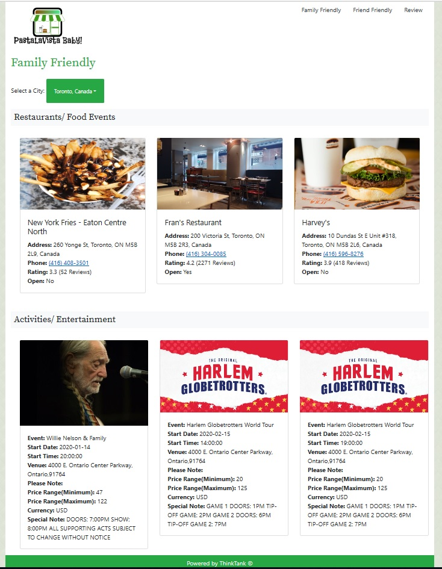

# Pastalavista-Baby

<h1>https://jt0398.github.io/Pastalavista-Baby/</h1>

## Contributors

1. Judy Tan
2. Poonam Halani
3. Wajiha Ahmad

## Overview

Target Audience for our product: People of age 13 and over.

How is it helpful? “As a user, I want to be able to find restaurants and fun-activities, so that I can plan a day out with my family or friends, and have an enjoyable time!”

Primary Goal of our product: Provide users a web application where they can find restaurants and events taking place in various cities and countries so they can plan a fun day without having to spend a long time just finding “where to go?” in GTA.

Features:
This web app is called “PastaLaVista-Baby!” . This will help users remember the application name!
Users will go on the website and choose between two options based on who they are going out with. (Buttons: “Family-Friendly” or “Friends Friendly”)

Based on their selection in step 1, they will be provided with the top 3 restaurant options and top 3 events taking place in the city/country they select from the drop down menue, whether it’s “Family-Friendly" or "Friends-Friendly".

## Technology Stack

HTML, CSS, BOOTSTRAP, JQUERY, APIs (TicketMaster and Google)

## How to Install

To run Pastalavista-Baby, you will first need to clone the repository to your local machine.

    HTTPS:
    ```
    $ git clone https://github.com/jt0398/Pastalavista-Baby.git
    ````
    SSH:
    ````
    $ git clone git@github.com:jt0398/Pastalavista-Baby.git
    ````

Signup to [Google](https://developers.google.com/) and [Ticketmaster](https://developer.ticketmaster.com/products-and-docs/apis/getting-started/) to get an API key. Update the script.js file with your API keys.

Browser to the folder where the project is cloned and double click on index.html to launch the application in a browser.


